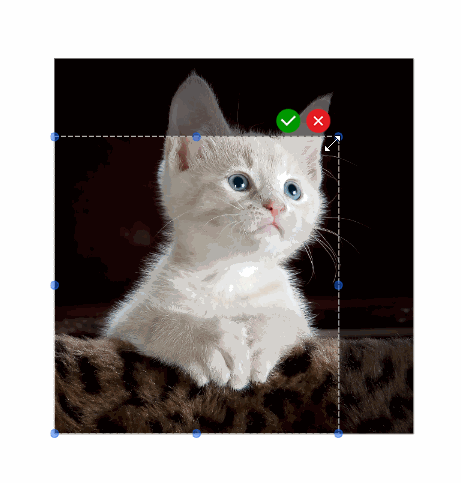

# fabric-crop

Crop fabric.js image with a single line of code.

- To crop, click the checkmark button.
- To cancel, click the X button or click away from the window.



## Demo

Check out the examples:

- [Basic example](https://codepen.io/jgznzflb-the-reactor/pen/xxNXvVp)


## Dependencies

fabric: "^5.3.0"

## Installation

```shell
npm i fabric-crop
```

## Basic usage

```js
import { initCrop } from "fabric-crop";

// 'image' refers to the image instance you want to crop.
// 'canvas' refers to the canvas instance.
initCrop(image, canvas);
```

## Advanced usage

You can pass the third argument for customization.

```js
import { initCrop } from "fabric-crop";
import { fabric } from "fabric";

// 'image' refers to the image instance you want to crop.
// 'canvas' refers to the canvas instance.
// Below are some options that you might want to consider changing.
options = {
  // Same meaning as http://fabricjs.com/docs/fabric.Rect.html
  cropRect: {
    id: "crop-rect",
    strokeWidth: 0,
    strokeUniform: true,
    cornerColor: "rgba(23,101,240,0.5)",
    cornerStrokeColor: "rgba(23,101,240,0.5)",
    padding: 0,
    borderDashArray: [5, 2],
    fill: "rgba(255, 255, 255, 1)",
    globalCompositeOperation: "overlay",
    lockRotation: true,
  },
  // Same meaning as http://fabricjs.com/docs/fabric.Rect.html
  overlayRect:{
    id: "overlay-rect",
    selectable: false,
    selection: false,
    fill: "rgba(0, 0, 0, 0.5)",
    lockRotation: true,
  },
  // Check sample: http://fabricjs.com/custom-control-render
  okButton:{
    icon: defalutApplyIcon,
    iconSize: 24,
    x: 0.5,
    y: -0.5,
    offsetY: -16,
    offsetX: -50,
    cursorStyle: "pointer",
    cornerSize: 24,
  },
  // Check sample: http://fabricjs.com/custom-control-render
  cancelButton:{
    icon: defalutCancelIcon,
    iconSize: 24,
    x: 0.5,
    y: -0.5,
    offsetY: -16,
    offsetX: -20,
    cursorStyle: "pointer",
    cornerSize: 24,
  }
  //If you've encapsulated your own Image class, you might want to pass in your own image loader.
  imageLoader:(url, options) => // If you
    new Promise((resolve) => {
        const imgElement = document.createElement("img");
        imgElement.onload = () => {
        resolve(new fabric.Image(imgElement, options));
        };
        imgElement.src = url;
    });

initCrop(image, canvas, options);
```
